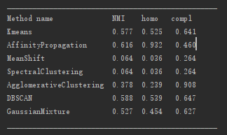
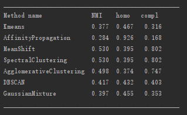

#                                                                                                  
Homework1: Clustering with sklearn  

## 一、    实验目的

  1、观察几种常用的聚类算法在给定数据集上使用的效果。

  2、了解几种聚类算法的原理与特点。

## 二、    实验内容

​        测试sklearn中以下聚类算法在以上两个数据集上的聚类效果：
  1、K-Means：给定一个数据点集合和需要的聚类数目k，k由用户指定，k均值算法根据某个距离函数反复把数据分入k个聚类中。 
  
  2、Affinity propagation：一种基于数据点之间的“信息传递”的聚类算法。 
  
  3、Mean Shift：算法的关键操作是通过感兴趣区域内的数据密度变化计算中心点的漂移向量，从而移动中心点进行下一次迭代，直到到达密度最大处。 
  
  4、Spectral Clustering：是一种基于图论的聚类方法。将带权无向图划分为两个或两个以上的最优子图，使子图内部尽量相似，而子图间距离尽量距离较远，以达到常见的聚类的目的。 
  
  5、Ward hierarchical clustering：层次聚类算法，层次聚类试图在不同的“层次”上对样本数据集进行划分，一层一层地进行聚类。就划分策略可分为自底向上的凝聚方法和自上向下的分裂方法。 
  
  6、Agglomerative clustering：是一种自底而上的层次聚类方法，它能够根据指定的相似度或距离定义计算出类之间的距离。
  
  7、DBSCAN：是一个比较有代表性的基于密度的聚类算法，将簇定义为密度相连的点的最大集合。 
  
  8、Gaussian Mixture：把数据可以看作是从数个高斯分布中生成出来的。

## 三、    实验步骤

  1、实验环境搭建：在Windows下安装pycharm,Anaconda3并配置环境。
  
  2、实现过程：模块导入、数据集导入、不同聚类算法的选择、参数调整、输出。

## 四、    实验结果与分析

### （1）sklearn.datasets.load_digits

### （2）sklearn.datasets.fetch_20newsgroups

## 五、    结论

​        聚类是一种机器学习技术，它涉及到数据点的分组。给定一组数据点，我们可以使用聚类算法将每个数据点划分为一个特定的组。理论上，同一组中的数据点应该具有相似的属性和/或特征，而不同组中的数据点应该具有高度不同的属性和/或特征。对于不同的聚类方法来说，有各自的优缺点，不同的方法在实验过程中有不同的表现。

​        在实际应用中可能需要在各种应用条件下进行聚类,而不同的聚类算法在不同的应用场景中的效果是不同,因此熟悉各种算法，有助于我们找到具有良好性能的算法。

